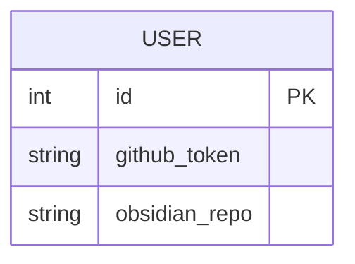

# Technical Design Document: Developer Assistant Platform

**Version:** 1.0-draft
**Date:** 2026-05-25
**PRD Reference:** docs/prd.md
**Status:** Draft — Pending Verification

## 1. Architecture Overview
The system consists of a Next.js frontend web app and an Express.js backend API built in TypeScript. The backend interacts with the LLM APIs to process queries, and runs background crons. A PostgreSQL database stores user configurations, chat history.

## 2. Tech Stack
| Layer    | Recommendation              | Rationale |
| -------- | --------------------------- | --------- |
| Frontend | Next.js (React)             | Excellent for an accompanying web app dashboard, works seamlessly with TS. |
| Backend  | Node.js / Express           | Fast, reliable, and native TS support to handle webhook routing for the agents. |
| Database | PostgreSQL                  | Strong relation support, sandboxed instances for the SQL learning tool. |
| ORM      | Prisma                      | Provides end-to-end type safety for the DB interactions in Node.js/TS. |
| Hosting  | Vercel (Web) + Render/Railway | Vercel for the web app, and Render/Railway for easily spinning up the background worker/webhook backend and the Postgres instance. |

## 3. Data Model

## 4. API Design
**Core Endpoints (Backend):**
- `GET /api/settings` - Fetches user settings for the web app.
- `PATCH /api/settings` - Updates user configurations (GitHub token, etc.).

## 5. Authentication & Authorization
Given it's initially scoped as a personal tool:
- **Web App:** Simple password or a single admin user authentication (e.g., using NextAuth or a static access token).

## 6. Third-Party Integrations
- **LLM API (Gemini):** For Socratic mentoring, summarization, and SQL analysis.
- **GitHub API:** To commit generated markdown files to the Obsidian repository.
- **YouTube Transcript API:** To extract subtitles from videos.

## 7. Non-Functional Requirements
- **Performance:** Webhook responses should return quickly. Long-running tasks (like fetching transcripts and hitting LLMs) must be deferred or processed asynchronously to prevent webhook timeouts.
