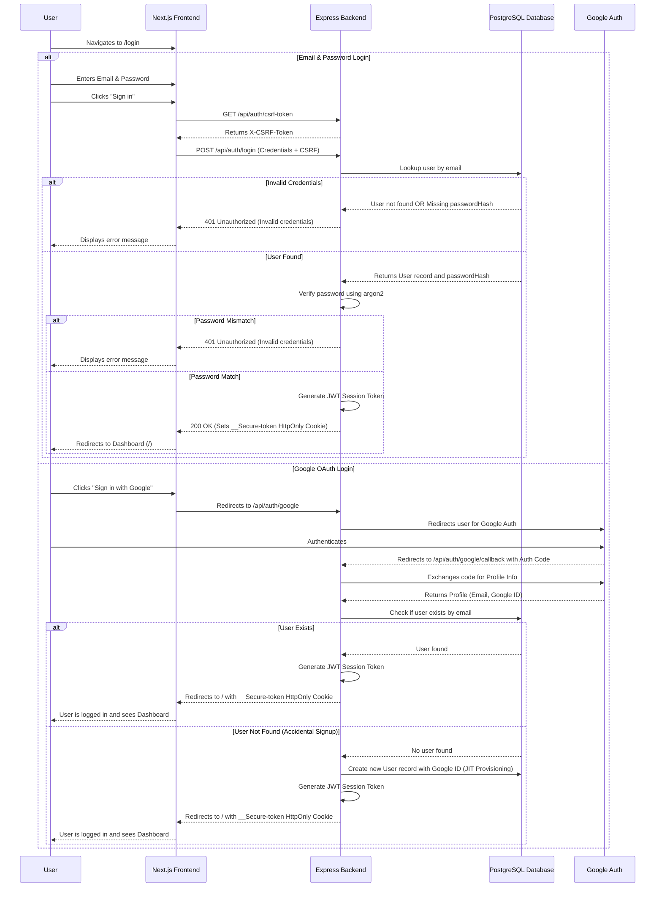

# Login User Flow

This document outlines the authentication and login process for the Lucy platform. Users can securely access their accounts using either Email/Password or Google OAuth.

## Mermaid Diagram

## Security Considerations

- **Credential Obfuscation:** The backend returns a generic "Invalid credentials" error for both unrecognized emails and incorrect passwords to prevent user enumeration attacks.
- **CSRF Protection:** State-changing requests like login are protected by a strict Cross-Site Request Forgery (CSRF) token implemented via the `double-submit cookie` pattern.
- **Stateless Authentication:** Successful logins grant a stateless JSON Web Token (JWT) injected seamlessly into an `HttpOnly` and `Secure` cookie, ensuring that user sessions are resistant to token-theft via cross-site scripting (XSS).
