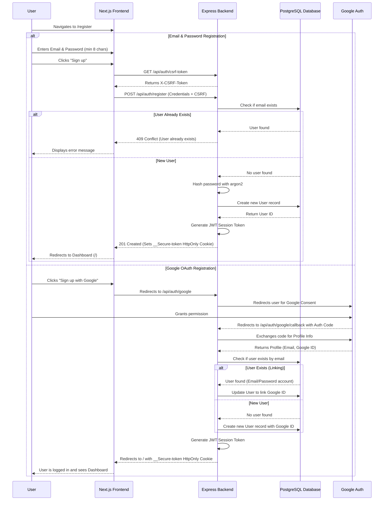

# Registration User Flow

This document outlines the registration process for the Lucy platform. The system supports two primary methods for account creation: Email/Password and Google OAuth.

## Mermaid Diagram

## Security Considerations

- **CSRF Protection:** The frontend automatically fetches a CSRF token from the backend and includes it in state-changing requests (`POST /api/auth/register`) to prevent Cross-Site Request Forgery attacks.
- **Secure Sessions:** Sessions are issued via JSON Web Tokens (JWT) mapped to secure, stateless `__Secure-token` `HttpOnly` cookies, preventing the tokens from being accessed by malicious client-side JavaScript (protecting against XSS).
- **Password Hashing:** Passwords are hashed using the memory-hard `argon2` algorithm with unique per-user salts, ensuring high resilience against brute-force and rainbow table attacks.
- **Input Validation:** The backend enforces a strong minimum password length before processing the registration request.
